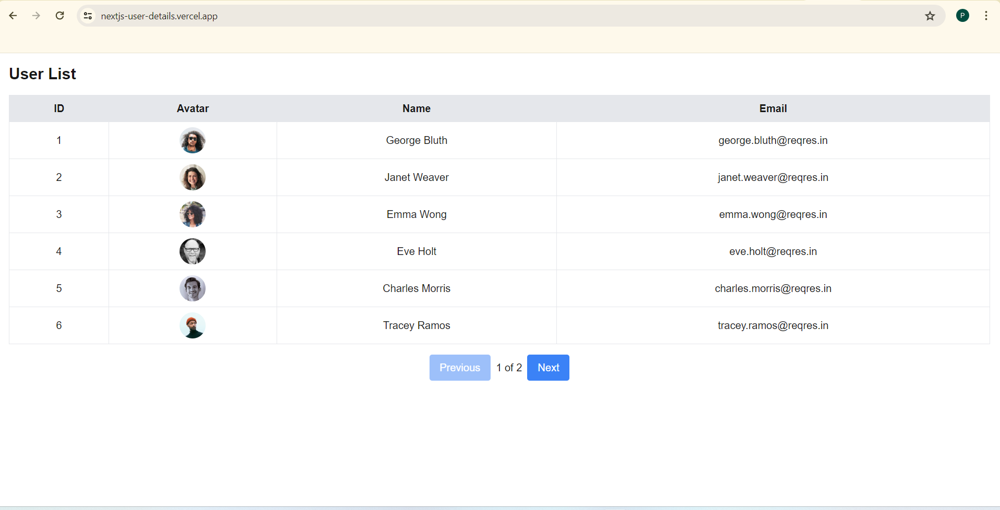

# User Details Paginated - Next.js Project

## 🚀 Project Overview
This is a **Next.js** application that displays a paginated user list fetched from an API. Users can navigate between pages using **Next.js routing** and **search parameters**.

## 🛠 Tech Stack
- **Frontend:** Next.js, React, Tailwind CSS
- **Backend API:** [ReqRes API](https://reqres.in/) (for mock user data)

## 📂 Project Structure
```
/user-details-paginated
├── src
│   ├── app
│   │   ├── page.js (Server Component)
│   │   ├── MyComponent.js (Client Component)
│   ├── styles
├── public
├── .gitignore
├── package.json
├── README.md
```

##  Installation & Setup
1. **Clone the repository**
   ```sh
   git clone https://github.com/Prashu2024/nextjs-user-details
   cd user-details-paginated
   ```
2. **Install dependencies**
   ```sh
   npm install
   ```
3. **Run the development server**
   ```sh
   npm run dev
   ```
   The app will be available at `http://localhost:3000`.

## 📌 Features
 **Paginated User List** - Fetches users from an API and displays them in a responsive table.  
 **Next.js Routing** - Uses search parameters (`useSearchParams`) for page navigation.  
 **Responsive UI** - Optimized for both desktop and mobile using Tailwind CSS.  
 **Error Handling** - Handles API failures gracefully.

## 📸 Screenshots
| Desktop View | Mobile View |
|-------------|------------|
|  |  |

## 🏗 Build & Deployment
To build the project for production:
```sh
npm run build
```
Deployed on [ **Vercel** ](https://nextjs-user-details.vercel.app)


---
Made by [Prashant Gupta](https://github.com/Prashu2024)

